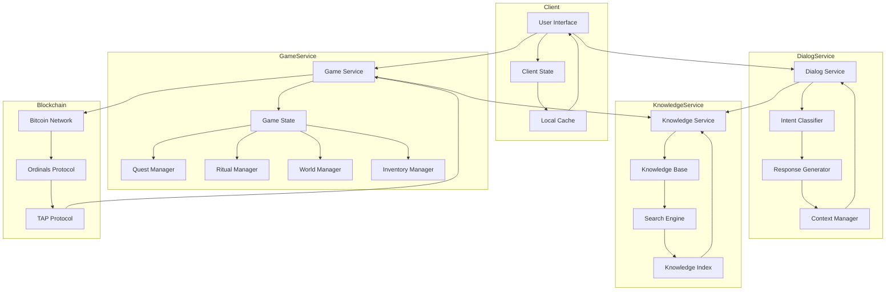
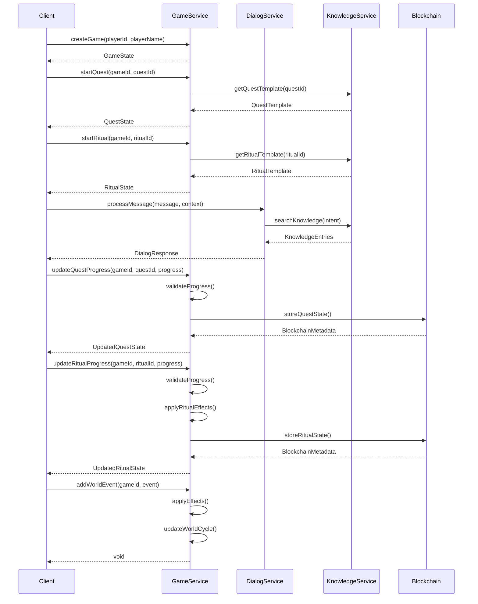
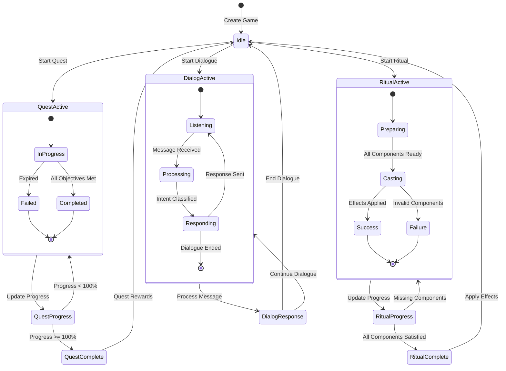

# 🏛️ Enochian Governor Generation System

A sophisticated game engine that creates mystical storylines and interactive experiences using 91 unique AI entities (Governor Angels) powered by wisdom from 18 mystical traditions.

## 🌟 Features

- **Knowledge Base**: Comprehensive storage of mystical wisdom from 18 traditions
- **Dialog Engine**: Dynamic conversation system with Governor Angels
- **Game Loops**: Quest progression, ritual mechanics, and world events
- **Blockchain Integration**: Eternal preservation of content using Bitcoin
- **P2P Network**: Decentralized game state synchronization

## 🔧 Technical Architecture

### Core Services

#### 1. Knowledge Service
- Manages the storage and retrieval of mystical wisdom
- Implements semantic search and cross-referencing
- Validates and indexes knowledge entries
- Integrates with blockchain storage

#### 2. Dialog Service
- Processes player-governor interactions
- Classifies intents and generates responses
- Maintains conversation context
- Tracks dialog statistics

#### 3. Game Service
- Manages game state and progression
- Handles quests and ritual mechanics
- Controls inventory and world events
- Synchronizes with blockchain

### Data Flow



### Service Interactions



### Game State Transitions



## 🚀 Getting Started

### Prerequisites

- Node.js 18+
- TypeScript 5.3+
- Bitcoin Node (for blockchain integration)

### Installation

1. Clone the repository:
   ```bash
   git clone https://github.com/yourusername/governor_generator.git
   cd governor_generator
   ```

2. Install dependencies:
   ```bash
   npm install
   ```

3. Build the project:
   ```bash
   npm run build
   ```

4. Run tests:
   ```bash
   npm test
   ```

### Configuration

1. Create a `.env` file with required settings:
   ```env
   BITCOIN_NODE_URL=http://localhost:8332
   BITCOIN_RPC_USER=your_rpc_user
   BITCOIN_RPC_PASS=your_rpc_password
   ```

2. Configure logging levels in `src/core/utils/logger.ts`

## 📚 Documentation

- [Knowledge Base Schema](docs/technical-specs/knowledge-base.md)
- [Dialog Engine](docs/technical-specs/dialog-engine.md)
- [Game Loops](docs/technical-specs/game-loops.md)
- [Quest Flow](docs/lighthouse/diagrams/flows/quest-flow.md)
- [Dialog Flow](docs/lighthouse/diagrams/flows/dialog-flow.md)
- [System Architecture](docs/lighthouse/diagrams/system/system-architecture.md)

## 🧪 Testing

The project includes comprehensive test suites for all core services:

- Knowledge Service Tests
- Dialog Service Tests
- Game Service Tests

Run tests with coverage:
```bash
npm run test:coverage
```

## 🔒 Security

- All API keys stored in `.env` (never committed)
- Rate limiting on external API calls
- Input validation and sanitization
- Secure authentication for admin features
- HTTPS for all external communications

## 📦 Deployment

1. Build for production:
   ```bash
   npm run build
   ```

2. Start the server:
   ```bash
   npm start
   ```

## 🤝 Contributing

1. Fork the repository
2. Create a feature branch
3. Commit your changes
4. Push to the branch
5. Create a Pull Request

## 📄 License

This project is licensed under the ISC License.

## ⛓️ Blockchain Integration

The system uses Bitcoin's Ordinals and TAP protocols for:
- Content storage
- State management
- Asset ownership
- Quest verification
- Ritual completion

## 🌐 P2P Network

The P2P network handles:
- Game state synchronization
- Player interactions
- World events
- Quest updates
- Ritual effects

## 🎮 Game Mechanics

### Quests
- Dynamic generation from knowledge base
- Progress tracking
- Reward distribution
- Blockchain verification

### Rituals
- Component requirements
- Effect application
- World state impact
- Energy management

### Inventory
- Item management
- Category tracking
- Capacity limits
- Blockchain ownership

### World Events
- Cycle management
- Effect application
- State updates
- Cross-player impact

## 📊 Statistics

The system tracks:
- Quest completion rates
- Ritual success rates
- Player progression
- Dialog interactions
- World state changes

## 🔮 Future Enhancements

1. Advanced AI Integration
   - Improved intent classification
   - Dynamic response generation
   - Personality evolution

2. Extended Blockchain Features
   - Cross-chain integration
   - Layer 2 scaling
   - Enhanced asset management

3. Enhanced Game Mechanics
   - Multi-player rituals
   - Guild systems
   - Trading mechanics

4. Improved P2P Features
   - Direct player interactions
   - Distributed state management
   - Real-time updates

## 🏛️ Remember

We are preserving humanity's sacred wisdom for eternity. Code with reverence, respect, and technical excellence. ⛓️✨