Looking at the `great_library.md` document, I'll adapt it to create a comprehensive implementation guide that reflects your current architecture, The Lighthouse vision, and the specific needs of your Governor Generator project.

<implementation_instructions>

# 🏛️ **THE LIGHTHOUSE PROJECT: SACRED WISDOM PRESERVATION SYSTEM**

## 🎯 **HIGH-LEVEL OVERVIEW: THE LIGHTHOUSE KNOWLEDGE BASE**

**Problem**: The governor storyline generation system currently lacks deep wisdom integration. Governors have `knowledge_base_selections` but no comprehensive local repository to draw from. We need a permanent, immutable repository of sacred wisdom that can enhance storyline generation while preserving humanity's mystical traditions for posterity.

**MVP Solution**: Build **The Lighthouse** - a comprehensive local wisdom library that:
1. **Preserves** 17 sacred wisdom traditions as permanent on-chain knowledge blocks
2. **Integrates** seamlessly with existing storyline engine and governor profiling systems  
3. **Enables** rich, contextually-aware storyline generation using deep wisdom
4. **Serves** as humanity's permanent mystical knowledge repository

**Current State**: 
- ✅ Clean architecture established (`traditions/`, `schemas/`, `utils/`)
- ✅ 3/17 tradition databases implemented (Enochian, Hermetic, Kabbalah - 30 entries active)
- ✅ Integration layer working with unified knowledge retriever
- ❌ 14 tradition databases missing (122-168 entries needed)
- ❌ Vector search and semantic retrieval not implemented
- ❌ Storyline engine integration incomplete

**Architecture**: Three-tier system with **Knowledge Creation → Processing → Integration** pipeline optimized for blockchain preservation.

---

## 📚 **LIGHTHOUSE WISDOM SYSTEM IMPLEMENTATION**

### **PHASE 1: Complete Missing Tradition Databases**

#### **Input/Output Contracts:**
```python
# Input: Tradition research and canonical sources
# Output: Complete tradition database files in knowledge_base/traditions/

from typing import List, Dict, Optional
from enum import Enum
from dataclasses import dataclass

class KnowledgeType(Enum):
    PRINCIPLE = "principle"
    PRACTICE = "practice" 
    SYSTEM = "system"
    CONCEPT = "concept"
    HISTORICAL = "historical"
    PRACTICAL = "practical"

class ContentQuality(Enum):
    HIGH = "high"          # Primary sources, expert verified
    MEDIUM = "medium"      # Secondary sources, well-researched
    FOUNDATIONAL = "foundational"  # Core concepts, universally accepted

@dataclass
class KnowledgeEntry:
    id: str                    # Format: "tradition_type_###"
    tradition: str             # Tradition key (e.g., "thelema")
    title: str                 # Clear, descriptive title
    summary: str               # 2-3 sentence overview for quick reference
    full_content: str          # 500-1000 words, blockchain-optimized
    knowledge_type: KnowledgeType
    tags: List[str]            # Searchable keywords
    related_concepts: List[str] # Cross-references to other entries
    source_url: Optional[str]   # Canonical reference link
    confidence_score: float     # 0.85-0.95 for high-quality entries
    quality: ContentQuality
    preservation_priority: str  # "critical", "foundational", "practical"

def create_tradition_database(tradition_name: str) -> List[KnowledgeEntry]:
    """
    Input: Tradition name (e.g., "thelema", "egyptian_magic")
    Output: Complete database with 8-14 high-quality knowledge entries
    """
    pass
```

#### **Required Tradition Databases (Priority Order):**

**PRIORITY 1 - Critical Foundations (Complete First):**
```python
# File: knowledge_base/traditions/golden_dawn_knowledge_database.py
# Status: Extend existing (need 6-8 more entries)
# Target: 12-15 total entries covering: Tree of Life, Rituals, Tarot Integration

# File: knowledge_base/traditions/thelema_knowledge_database.py  
# Status: Create new
# Target: 10-12 entries covering: True Will, Thelemic Law, Magick System, Liber AL

# File: knowledge_base/traditions/egyptian_magic_knowledge_database.py
# Status: Create new  
# Target: 11-14 entries covering: Neteru, Hieroglyphic Magic, Temple Practices, Ma'at
```

**PRIORITY 2 - Complementary Systems:**
```python
# File: knowledge_base/traditions/gnostic_traditions_knowledge_database.py
# Target: 9-12 entries covering: Sophia, Archons, Pleroma, Gnostic Gospels

# File: knowledge_base/traditions/tarot_knowledge_database.py
# Target: 10-13 entries covering: Major Arcana, Minor Arcana, Spreads, Symbolism

# File: knowledge_base/traditions/sacred_geometry_knowledge_database.py  
# Target: 8-11 entries covering: Platonic Solids, Golden Ratio, Merkaba, Flower of Life

# File: knowledge_base/traditions/classical_philosophy_knowledge_database.py
# Target: 9-12 entries covering: Platonism, Neoplatonism, Stoicism, Aristotelian Ethics

# File: knowledge_base/traditions/taoism_knowledge_database.py
# Target: 11-13 entries covering: Tao, Wu Wei, Yin-Yang, Five Elements, Qigong

# File: knowledge_base/traditions/i_ching_knowledge_database.py
# Target: 10-12 entries covering: 64 Hexagrams, Eight Trigrams, Book of Changes

# File: knowledge_base/traditions/kuji_kiri_knowledge_database.py  
# Target: 9-12 entries covering: Nine Hand Seals, Buddhist Esotericism, Mudra Energy
```

**PRIORITY 3 - Specialized Traditions:**
```python
# File: knowledge_base/traditions/chaos_magic_knowledge_database.py
# File: knowledge_base/traditions/norse_traditions_knowledge_database.py
# File: knowledge_base/traditions/sufi_mysticism_knowledge_database.py
# File: knowledge_base/traditions/celtic_druidic_knowledge_database.py
```

#### **Standard Database Template:**
```python
# File: knowledge_base/traditions/[tradition]_knowledge_database.py

import logging
from typing import List, Dict, Optional
from ..schemas.knowledge_schemas import KnowledgeEntry, KnowledgeType, ContentQuality

# VITAL LOGGING - Track database creation and access
logger = logging.getLogger(f"KnowledgeDB.{__name__.split('.')[-1]}")

def create_[tradition]_tradition() -> List[KnowledgeEntry]:
    """
    Creates the complete [Tradition] knowledge database
    
    Returns:
        List of 8-14 high-quality knowledge entries covering core concepts
    """
    logger.info(f"Creating {tradition} tradition database")
    
    entries = [
        # PRINCIPLES (2-3 entries)
        KnowledgeEntry(
            id=f"{tradition}_principle_001",
            tradition="{tradition}",
            title="[Core Principle Title]",
            summary="Brief 2-3 sentence explanation of this fundamental principle.",
            full_content="""
            Detailed 500-1000 word explanation covering:
            - Historical context and origins
            - Practical applications and methods
            - Philosophical implications
            - Cross-references to related concepts
            - Modern interpretations and applications
            """,
            knowledge_type=KnowledgeType.PRINCIPLE,
            tags=["fundamental", "core_concept", "tradition_specific"],
            related_concepts=["related_entry_id_1", "related_entry_id_2"],
            source_url="https://canonical-source.com/reference",
            confidence_score=0.90,
            quality=ContentQuality.HIGH,
            preservation_priority="critical"
        ),
        
        # PRACTICES (3-4 entries)
        # SYSTEMS (2-3 entries)  
        # CONCEPTS (2-3 entries)
        # HISTORICAL (1-2 entries)
    ]
    
    logger.info(f"✅ Created {len(entries)} entries for {tradition} tradition")
    return entries

def get_[tradition]_entry_by_id(entry_id: str) -> Optional[KnowledgeEntry]:
    """Get specific entry by ID"""
    entries = create_[tradition]_tradition()
    return next((entry for entry in entries if entry.id == entry_id), None)

def search_[tradition]_by_tag(tag: str) -> List[KnowledgeEntry]:
    """Search entries by tag"""
    entries = create_[tradition]_tradition()
    return [entry for entry in entries if tag in entry.tags]

def get_all_[tradition]_entries() -> List[KnowledgeEntry]:
    """Get all entries for this tradition"""
    return create_[tradition]_tradition()
```

### **PHASE 2: Enhanced Unified Knowledge Retriever**

#### **Input/Output Contracts:**
```python
# Input: Governor selections, search queries, tradition filters
# Output: Contextually relevant knowledge entries for storyline generation

class UnifiedWisdomRetriever:
    def get_governor_knowledge(self, governor_data: Dict) -> Dict[str, List[KnowledgeEntry]]:
        """
        Input: Governor profile with knowledge_base_selections
        Output: Structured knowledge organized by tradition
        """
        pass
    
    def semantic_search(self, query: str, traditions: List[str] = None, limit: int = 10) -> List[KnowledgeEntry]:
        """
        Input: Natural language query, optional tradition filters
        Output: Semantically similar knowledge entries
        """
        pass
```

#### **Enhanced Unified Retriever:**
```python
# File: knowledge_base/traditions/unified_knowledge_retriever.py

import logging
from typing import List, Dict, Optional, Set
from .knowledge_schemas import KnowledgeEntry, KnowledgeType

# Import all tradition databases
from .enochian_knowledge_database import get_all_enochian_entries
from .hermetic_knowledge_database import get_all_hermetic_entries  
from .kabbalah_knowledge_database import get_all_kabbalah_entries
from .golden_dawn_knowledge_database import get_all_golden_dawn_entries
from .thelema_knowledge_database import get_all_thelema_entries
from .egyptian_magic_knowledge_database import get_all_egyptian_magic_entries
# ... import all 17 tradition databases

# VITAL LOGGING - Track knowledge retrieval patterns
logger = logging.getLogger("UnifiedWisdomRetriever")

class LighthouseKnowledgeRetriever:
    """
    The Lighthouse: Unified access to all sacred wisdom traditions
    Optimized for governor storyline generation and preservation
    """
    
    def __init__(self):
        self.tradition_map = {
            'enochian': get_all_enochian_entries,
            'hermetic': get_all_hermetic_entries,
            'kabbalah': get_all_kabbalah_entries,
            'golden_dawn': get_all_golden_dawn_entries,
            'thelema': get_all_thelema_entries,
            'egyptian_magic': get_all_egyptian_magic_entries,
            # ... map all 17 traditions
        }
        
        logger.info(f"🏛️ Lighthouse initialized with {len(self.tradition_map)} traditions")
    
    def get_all_knowledge(self) -> Dict[str, List[KnowledgeEntry]]:
        """
        Retrieve complete knowledge base - all traditions, all entries
        Used for system validation and blockchain preparation
        """
        logger.info("📚 Retrieving complete Lighthouse knowledge base")
        
        complete_knowledge = {}
        total_entries = 0
        
        for tradition_name, get_entries_func in self.tradition_map.items():
            try:
                entries = get_entries_func()
                complete_knowledge[tradition_name] = entries
                total_entries += len(entries)
                logger.info(f"✅ {tradition_name}: {len(entries)} entries loaded")
            except Exception as e:
                logger.error(f"❌ Failed to load {tradition_name}: {e}")
                complete_knowledge[tradition_name] = []
        
        logger.info(f"🏛️ Lighthouse complete: {total_entries} total entries across {len(complete_knowledge)} traditions")
        return complete_knowledge
    
    def get_governor_wisdom_context(self, governor_data: Dict) -> Dict:
        """
        Extract relevant wisdom for specific governor's storyline generation
        """
        governor_name = governor_data.get('name', 'Unknown')
        selections = governor_data.get('knowledge_base_selections', {})
        
        logger.info(f"🔍 Retrieving wisdom context for Governor {governor_name}")
        logger.info(f"📋 Knowledge selections: {list(selections.keys())}")
        
        wisdom_context = {
            'governor_name': governor_name,
            'selected_traditions': {},
            'cross_references': [],
            'total_entries': 0,
            'wisdom_summary': ""
        }
        
        # Collect knowledge from selected traditions
        for tradition_name, selection_details in selections.items():
            if tradition_name in self.tradition_map:
                entries = self.tradition_map[tradition_name]()
                wisdom_context['selected_traditions'][tradition_name] = entries
                wisdom_context['total_entries'] += len(entries)
                
                # Log tradition-specific context
                logger.info(f"📖 {tradition_name}: {len(entries)} entries available")
            else:
                logger.warning(f"⚠️ Tradition '{tradition_name}' not found in Lighthouse")
        
        # Generate cross-references between selected traditions
        wisdom_context['cross_references'] = self._find_cross_references(
            wisdom_context['selected_traditions']
        )
        
        # Create wisdom summary for storyline context
        wisdom_context['wisdom_summary'] = self._create_wisdom_summary(
            wisdom_context['selected_traditions']
        )
        
        logger.info(f"✅ Wisdom context ready: {wisdom_context['total_entries']} entries, {len(wisdom_context['cross_references'])} cross-references")
        return wisdom_context
    
    def _find_cross_references(self, selected_traditions: Dict) -> List[Dict]:
        """
        Find conceptual connections between selected traditions
        """
        cross_refs = []
        tradition_names = list(selected_traditions.keys())
        
        for i, tradition_a in enumerate(tradition_names):
            for tradition_b in tradition_names[i+1:]:
                entries_a = selected_traditions[tradition_a]
                entries_b = selected_traditions[tradition_b]
                
                # Find entries with overlapping tags or related concepts
                for entry_a in entries_a:
                    for entry_b in entries_b:
                        common_tags = set(entry_a.tags) & set(entry_b.tags)
                        if common_tags or entry_b.id in entry_a.related_concepts:
                            cross_refs.append({
                                'tradition_a': tradition_a,
                                'entry_a': entry_a.title,
                                'tradition_b': tradition_b, 
                                'entry_b': entry_b.title,
                                'connection_type': 'conceptual_overlap',
                                'common_elements': list(common_tags)
                            })
        
        return cross_refs
    
    def _create_wisdom_summary(self, selected_traditions: Dict) -> str:
        """
        Create narrative summary of governor's wisdom profile
        """
        summary_parts = []
        
        for tradition_name, entries in selected_traditions.items():
            principles = [e for e in entries if e.knowledge_type == KnowledgeType.PRINCIPLE]
            practices = [e for e in entries if e.knowledge_type == KnowledgeType.PRACTICE]
            
            tradition_summary = f"""
            **{tradition_name.replace('_', ' ').title()}**: 
            - Core principles: {', '.join([p.title for p in principles[:3]])}
            - Key practices: {', '.join([p.title for p in practices[:3]])}
            """
            summary_parts.append(tradition_summary)
        
        return "\n".join(summary_parts)
```

### **PHASE 3: Vector Search & Semantic Retrieval**

#### **Required Packages:**
```bash
pip install sentence-transformers chromadb numpy faiss-cpu nltk spacy transformers torch
python -m spacy download en_core_web_sm
```

#### **Vector Database Implementation:**
```python
# File: knowledge_base/utils/vector_knowledge_search.py

import chromadb
from sentence_transformers import SentenceTransformer
import logging
from typing import List, Dict, Optional, Tuple
from ..schemas.knowledge_schemas import KnowledgeEntry

logger = logging.getLogger("VectorKnowledgeSearch")

class LighthouseVectorSearch:
    """
    Semantic search system for The Lighthouse knowledge base
    Enables intelligent retrieval based on meaning, not just keywords
    """
    
    def __init__(self, db_path: str = "knowledge_base/vector_db"):
        # Initialize embedding model
        self.embedder = SentenceTransformer('all-MiniLM-L6-v2')
        
        # Initialize ChromaDB
        self.client = chromadb.PersistentClient(path=db_path)
        self.collection = self.client.get_or_create_collection(
            name="lighthouse_wisdom",
            metadata={"description": "Sacred wisdom traditions for governor storylines"}
        )
        
        logger.info("🔍 Lighthouse Vector Search initialized")
    
    def index_all_knowledge(self, complete_knowledge: Dict[str, List[KnowledgeEntry]]):
        """
        Create vector embeddings for all knowledge entries
        """
        logger.info("📊 Creating vector embeddings for complete knowledge base")
        
        all_entries = []
        for tradition_name, entries in complete_knowledge.items():
            all_entries.extend(entries)
        
        # Prepare data for ChromaDB
        documents = []
        embeddings = []
        metadatas = []
        ids = []
        
        for entry in all_entries:
            # Create searchable document text
            doc_text = f"{entry.title}\n{entry.summary}\n{entry.full_content}"
            documents.append(doc_text)
            
            # Generate embedding
            embedding = self.embedder.encode(doc_text).tolist()
            embeddings.append(embedding)
            
            # Metadata for filtering
            metadatas.append({
                "tradition": entry.tradition,
                "knowledge_type": entry.knowledge_type.value,
                "title": entry.title,
                "summary": entry.summary,
                "tags": ",".join(entry.tags),
                "confidence_score": entry.confidence_score,
                "quality": entry.quality.value,
                "preservation_priority": entry.preservation_priority
            })
            
            ids.append(entry.id)
        
        # Add to ChromaDB collection
        self.collection.add(
            documents=documents,
            embeddings=embeddings,
            metadatas=metadatas,
            ids=ids
        )
        
        logger.info(f"✅ Indexed {len(all_entries)} knowledge entries for semantic search")
    
    def search_for_storyline_context(self, 
                                   governor_data: Dict, 
                                   storyline_theme: str = "",
                                   limit: int = 15) -> List[Dict]:
        """
        Search for knowledge entries relevant to governor's storyline generation
        """
        governor_name = governor_data.get('name', 'Unknown')
        selections = governor_data.get('knowledge_base_selections', {})
        personality = governor_data.get('personality_traits', [])
        specializations = governor_data.get('specializations', [])
        
        logger.info(f"🔍 Searching knowledge for {governor_name} storyline context")
        
        # Build comprehensive search query
        search_query = f"""
        Governor {governor_name} storyline context:
        Wisdom traditions: {', '.join(selections.keys())}
        Personality traits: {', '.join(personality)}
        Specializations: {', '.join(specializations)}
        Theme focus: {storyline_theme}
        Seeking relevant mystical knowledge, practices, and principles.
        """
        
        # Perform semantic search
        results = self.collection.query(
            query_texts=[search_query],
            n_results=limit,
            where={
                "$or": [
                    {"tradition": {"$in": list(selections.keys())}},
                    {"quality": "high"},
                    {"preservation_priority": "critical"}
                ]
            } if selections else {"quality": "high"}
        )
        
        logger.info(f"📖 Found {len(results['documents'][0])} relevant knowledge entries")
        return results
```

### **PHASE 4: Storyline Engine Integration**

#### **Enhanced Integration:**
```python
# File: storyline_engine/lighthouse_storyline_generator.py

from knowledge_base.traditions.unified_knowledge_retriever import LighthouseKnowledgeRetriever
from knowledge_base.utils.vector_knowledge_search import LighthouseVectorSearch
import logging
import anthropic
import os

logger = logging.getLogger("LighthouseStorylineGenerator")

class LighthouseEnhancedStorylineGenerator:
    """
    Storyline generator enhanced with The Lighthouse wisdom integration
    Generates rich, contextually-aware narratives using sacred wisdom
    """
    
    def __init__(self):
        self.lighthouse = LighthouseKnowledgeRetriever()
        self.vector_search = LighthouseVectorSearch()
        self.anthropic_client = anthropic.Anthropic(api_key=os.getenv('ANTHROPIC_API_KEY'))
        
        # Initialize vector search with complete knowledge base
        complete_knowledge = self.lighthouse.get_all_knowledge()
        self.vector_search.index_all_knowledge(complete_knowledge)
        
        logger.info("🏛️ Lighthouse-enhanced storyline generator ready")
    
    def generate_wisdom_enhanced_storyline(self, governor_data: Dict) -> Dict:
        """
        Generate storyline enhanced with deep wisdom context from The Lighthouse
        """
        governor_name = governor_data.get('name', 'Unknown')
        
        logger.info(f"📖 Generating wisdom-enhanced storyline for Governor {governor_name}")
        
        # 1. Extract governor's wisdom context
        wisdom_context = self.lighthouse.get_governor_wisdom_context(governor_data)
        
        # 2. Perform semantic search for additional relevant knowledge
        storyline_theme = governor_data.get('narrative_theme', 'mystical_governance')
        relevant_knowledge = self.vector_search.search_for_storyline_context(
            governor_data, storyline_theme, limit=20
        )
        
        # 3. Build comprehensive context for AI generation
        enhanced_context = self._build_storyline_context(
            governor_data, wisdom_context, relevant_knowledge
        )
        
        # 4. Generate storyline using Anthropic API
        storyline = self._generate_with_lighthouse_context(
            governor_data, enhanced_context
        )
        
        logger.info(f"✅ Generated wisdom-enhanced storyline for {governor_name}")
        return storyline
    
    def _build_storyline_context(self, 
                               governor_data: Dict, 
                               wisdom_context: Dict, 
                               semantic_results: List[Dict]) -> str:
        """
        Build comprehensive context string for storyline generation
        """
        context_parts = [
            f"# GOVERNOR {governor_data.get('name', 'Unknown').upper()} - WISDOM PROFILE",
            "",
            "## SELECTED WISDOM TRADITIONS:",
            wisdom_context['wisdom_summary'],
            "",
            "## CROSS-TRADITION CONNECTIONS:",
        ]
        
        # Add cross-references
        for cross_ref in wisdom_context['cross_references'][:5]:
            context_parts.append(
                f"- {cross_ref['tradition_a']} ↔ {cross_ref['tradition_b']}: "
                f"{cross_ref['entry_a']} relates to {cross_ref['entry_b']}"
            )
        
        context_parts.extend([
            "",
            "## SEMANTICALLY RELEVANT KNOWLEDGE:",
        ])
        
        # Add semantic search results
        for i, doc in enumerate(semantic_results['documents'][0][:10]):
            metadata = semantic_results['metadatas'][0][i]
            context_parts.append(
                f"- **{metadata['tradition']}**: {metadata['title']} - {metadata['summary']}"
            )
        
        return "\n".join(context_parts)
    
    def _generate_with_lighthouse_context(self, governor_data: Dict, context: str) -> Dict:
        """
        Generate storyline using Anthropic API with Lighthouse context
        """
        system_prompt = """
        You are The Lighthouse Chronicler, an expert storyteller who weaves sacred wisdom 
        into compelling narratives about mystical governors. Use the provided wisdom context 
        to create rich, authentic storylines that honor the depth of these traditions while 
        crafting engaging character narratives.
        
        Focus on:
        - Authentic integration of wisdom traditions
        - Compelling character development  
        - Narrative coherence and flow
        - Respectful treatment of sacred concepts
        - Rich, immersive world-building
        """
        
        user_prompt = f"""
        Create a compelling storyline for this governor using their wisdom profile:
        
        {context}
        
        GOVERNOR PROFILE:
        {governor_data}
        
        Generate a rich, multi-chapter storyline that authentically incorporates their 
        selected wisdom traditions while creating an engaging narrative about their 
        mystical governance and personal journey.
        """
        
        # Generate storyline using Anthropic API
        response = self.anthropic_client.messages.create(
            model="claude-3-sonnet-20240229",
            max_tokens=4000,
            system=system_prompt,
            messages=[{"role": "user", "content": user_prompt}]
        )
        
        return {
            'governor_name': governor_data.get('name'),
            'storyline_content': response.content[0].text,
            'wisdom_traditions_used': list(governor_data.get('knowledge_base_selections', {}).keys()),
            'generation_metadata': {
                'total_knowledge_entries': len(context.split('\n')),
                'traditions_count': len(governor_data.get('knowledge_base_selections', {})),
                'generation_model': 'claude-3-sonnet-lighthouse-enhanced'
            }
        }
```

### **PHASE 5: System Architecture Diagram**

```mermaid
graph TD
    A[🏛️ The Lighthouse<br/>Complete Knowledge Base] --> B[📚 17 Tradition Databases]
    B --> C[🔍 Unified Knowledge Retriever]
    B --> D[🧠 Vector Search Engine]
    
    E[👑 Governor Profile] --> F[📖 Storyline Generator]
    C --> F
    D --> F
    
    F --> G[✨ Wisdom-Enhanced Storylines]
    
    H[⛓️ Blockchain Integration] --> I[🌐 On-Chain Preservation]
    A --> H
    
    J[🔄 Cross-Reference Engine] --> C
    K[🏷️ Semantic Indexing] --> D
    
    style A fill:#ffd700,stroke:#b8860b,stroke-width:3px
    style B fill:#e6f3ff,stroke:#0066cc,stroke-width:2px  
    style F fill:#f0fff0,stroke:#228b22,stroke-width:2px
    style G fill:#fff8dc,stroke:#daa520,stroke-width:2px
    style I fill:#e6e6fa,stroke:#6a5acd,stroke-width:2px
```



### **PHASE 6: Blockchain Preservation Integration**

#### **On-Chain Knowledge Blocks:**
```python
# File: knowledge_base/utils/blockchain_preparation.py

import json
import hashlib
from typing import List, Dict
from ..schemas.knowledge_schemas import KnowledgeEntry

class LighthouseBlockchainPrep:
    """
    Prepare Lighthouse knowledge for permanent on-chain preservation
    """
    
    def __init__(self):
        self.logger = logging.getLogger("LighthouseBlockchain")
    
    def create_preservation_blocks(self, complete_knowledge: Dict[str, List[KnowledgeEntry]]) -> List[Dict]:
        """
        Create blockchain-optimized knowledge blocks for permanent preservation
        """
        self.logger.info("⛓️ Preparing knowledge blocks for blockchain preservation")
        
        preservation_blocks = []
        
        for tradition_name, entries in complete_knowledge.items():
            # Create tradition block
            tradition_block = {
                "block_type": "wisdom_tradition",
                "tradition_name": tradition_name,
                "preservation_timestamp": self._get_timestamp(),
                "total_entries": len(entries),
                "knowledge_hash": self._calculate_tradition_hash(entries),
                "entries": []
            }
            
            # Add entries with preservation metadata
            for entry in entries:
                blockchain_entry = {
                    "id": entry.id,
                    "title": entry.title,
                    "summary": entry.summary,
                    "content": entry.full_content,
                    "type": entry.knowledge_type.value,
                    "quality": entry.quality.value,
                    "priority": entry.preservation_priority,
                    "tags": entry.tags,
                    "content_hash": hashlib.sha256(entry.full_content.encode()).hexdigest()
                }
                tradition_block["entries"].append(blockchain_entry)
            
            preservation_blocks.append(tradition_block)
            self.logger.info(f"📦 Created preservation block for {tradition_name}: {len(entries)} entries")
        
        self.logger.info(f"🏛️ Lighthouse preservation ready: {len(preservation_blocks)} tradition blocks")
        return preservation_blocks
    
    def _calculate_tradition_hash(self, entries: List[KnowledgeEntry]) -> str:
        """Calculate cryptographic hash for tradition verification"""
        combined_content = "".join([entry.full_content for entry in entries])
        return hashlib.sha256(combined_content.encode()).hexdigest()
    
    def _get_timestamp(self) -> str:
        """Get current timestamp for preservation records"""
        from datetime import datetime
        return datetime.utcnow().isoformat()
```

### **PHASE 7: Complete Implementation Pipeline**

```python
# File: knowledge_base/build_lighthouse.py

import asyncio
import logging
from pathlib import Path

async def build_complete_lighthouse():
    """
    Complete pipeline to build The Lighthouse knowledge preservation system
    """
    logger = logging.getLogger("LighthouseBuild")
    logger.info("🏛️ Beginning Lighthouse construction...")
    
    # Phase 1: Validate existing knowledge base
    lighthouse = LighthouseKnowledgeRetriever()
    current_knowledge = lighthouse.get_all_knowledge()
    
    current_total = sum(len(entries) for entries in current_knowledge.values())
    logger.info(f"📊 Current state: {current_total} entries across {len(current_knowledge)} traditions")
    
    # Phase 2: Identify missing databases
    required_traditions = [
        'golden_dawn', 'thelema', 'egyptian_magic', 'gnostic_traditions',
        'tarot_knowledge', 'sacred_geometry', 'classical_philosophy',
        'taoism', 'i_ching', 'kuji_kiri', 'chaos_magic', 'norse_traditions',
        'sufi_mysticism', 'celtic_druidic'
    ]
    
    missing_traditions = []
    for tradition in required_traditions:
        if tradition not in current_knowledge or len(current_knowledge[tradition]) == 0:
            missing_traditions.append(tradition)
    
    logger.info(f"❌ Missing traditions: {missing_traditions}")
    logger.info(f"🎯 Implementation needed: {len(missing_traditions)} tradition databases")
    
    # Phase 3: Initialize vector search system
    vector_search = LighthouseVectorSearch()
    vector_search.index_all_knowledge(current_knowledge)
    
    # Phase 4: Test integration
    test_governor = {
        'name': 'TESTNOCH',
        'knowledge_base_selections': {
            'enochian': {'focus': 'angelic_communication'},
            'hermetic': {'focus': 'as_above_so_below'}
        }
    }
    
    enhanced_generator = LighthouseEnhancedStorylineGenerator()
    test_storyline = enhanced_generator.generate_wisdom_enhanced_storyline(test_governor)
    
    logger.info("✅ Lighthouse integration test successful")
    
    # Phase 5: Prepare preservation blocks
    blockchain_prep = LighthouseBlockchainPrep()
    preservation_blocks = blockchain_prep.create_preservation_blocks(current_knowledge)
    
    logger.info(f"🏛️ The Lighthouse construction status:")
    logger.info(f"   - Active traditions: {len(current_knowledge)}")
    logger.info(f"   - Total knowledge entries: {current_total}")
    logger.info(f"   - Missing databases: {len(missing_traditions)}")
    logger.info(f"   - Preservation blocks ready: {len(preservation_blocks)}")
    logger.info(f"   - Integration: ✅ Working")
    logger.info(f"   - Vector search: ✅ Ready")
    logger.info(f"   - Blockchain prep: ✅ Complete")

if __name__ == "__main__":
    asyncio.run(build_complete_lighthouse())
```

</implementation_instructions>

## 🌟 **THE LIGHTHOUSE: TRANSFORMATIVE BENEFITS**

### **For Governor Storyline Generation:**
- **🎯 Contextual Richness**: Deep wisdom integration creates authentic, meaningful narratives
- **⚡ Speed**: Instant access to curated knowledge vs. slow web research
- **🧠 Intelligence**: Semantic search finds precisely relevant concepts
- **🔄 Consistency**: Reliable, high-quality knowledge base

### **For Sacred Wisdom Preservation:**
- **🏛️ Permanence**: Immutable on-chain storage ensures eternal accessibility
- **🌍 Universality**: Global access to humanity's mystical heritage
- **🔗 Integration**: Cross-tradition connections reveal universal principles
- **📈 Scalability**: Easy expansion with new traditions and knowledge

### **For Cultural Impact:**
- **🛡️ Protection**: Safeguards traditions against loss or distortion
- **🌉 Bridge-Building**: Connects Eastern and Western mystical paths
- **🎓 Education**: Accessible wisdom for scholars and practitioners
- **🔮 Innovation**: Enables new synthetic approaches to ancient wisdom

The Lighthouse transforms your Governor Generator from a simple profiling tool into **humanity's premier mystical knowledge preservation and synthesis system** - a permanent beacon of sacred wisdom for all generations! 🏛️✨