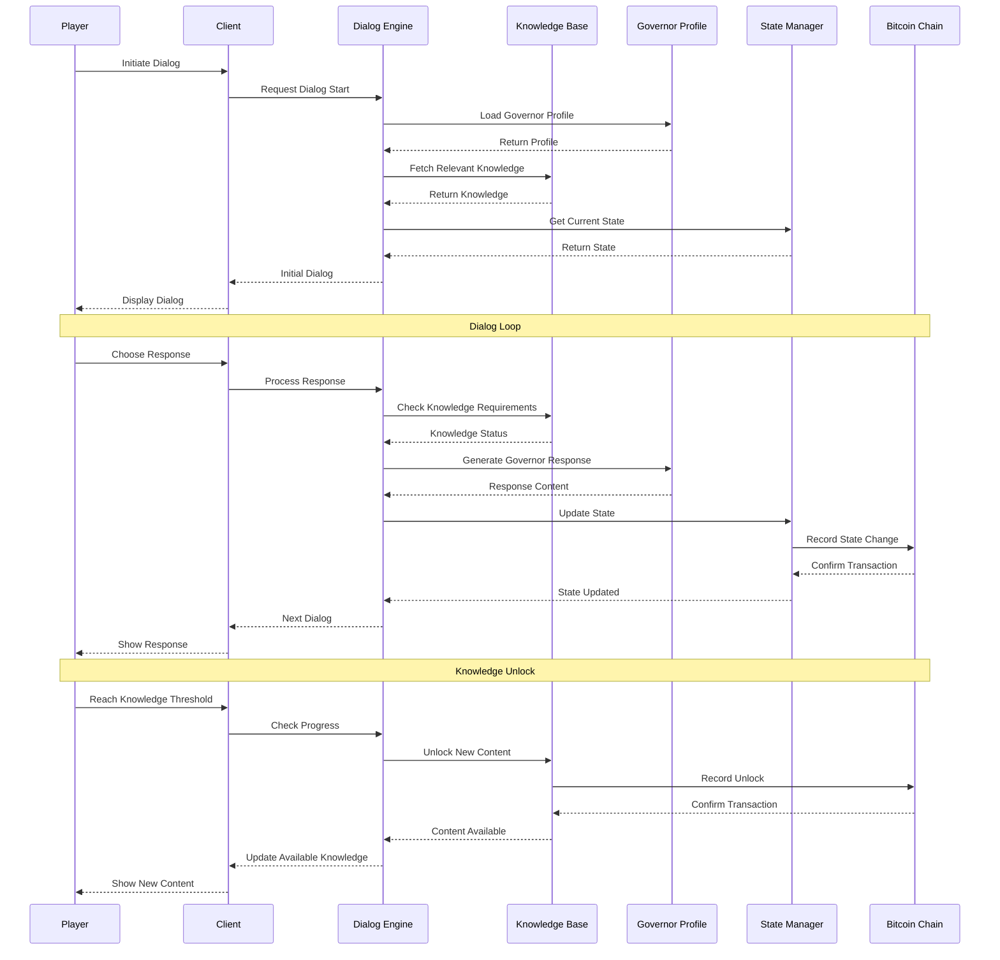
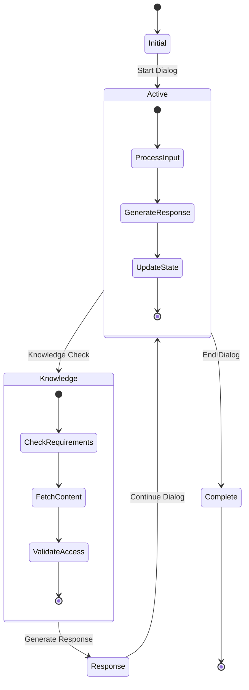
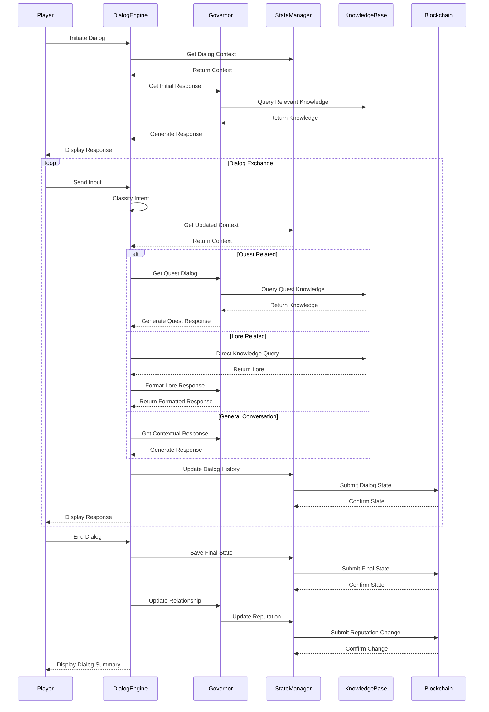

# Dialog System Flow

## Dialog Interaction Flow

## Dialog State Flow

## Component Descriptions

### Participants
- **Player**: End user interacting with the system
- **Client**: Local game client handling UI
- **Dialog Engine**: Core conversation management
- **Knowledge Base**: Content and wisdom storage
- **Governor Profile**: Governor personality and traits
- **State Manager**: Game state tracking
- **Bitcoin Chain**: Permanent record storage

### Key Interactions
1. **Dialog Initiation**
   - Player starts conversation
   - System loads governor profile
   - Relevant knowledge is fetched
   - Current state is checked
   - Initial dialog is presented

2. **Response Processing**
   - Player chooses response
   - System processes choice
   - Knowledge requirements checked
   - Governor response generated
   - State updated and recorded
   - Next dialog presented

3. **Knowledge Unlocking**
   - Progress threshold reached
   - New content unlocked
   - Unlock recorded on-chain
   - Content made available
   - Player notified

### State Transitions
- **Initial**: Starting state
- **Active**: Ongoing dialog
- **Knowledge**: Content checks
- **Response**: Response generation
- **Complete**: Dialog end

### On-Chain Integration
- Dialog progress recorded
- Knowledge unlocks tracked
- State changes permanent
- Progress verifiable
- Content accessibility managed

# Dialog Flow Sequence Diagram

## Overview
This diagram illustrates the sequence of interactions between system components during dialog generation and processing.

## Diagram

## Component Descriptions

### Player
- Initiates conversations
- Provides input/responses
- Receives governor responses
- Makes dialog choices

### DialogEngine
- Manages conversation flow
- Classifies player intent
- Coordinates responses
- Maintains dialog context

### Governor
- Provides personality-driven responses
- Accesses relevant knowledge
- Maintains conversation coherence
- Tracks relationship development

### StateManager
- Maintains dialog state
- Tracks conversation history
- Manages reputation changes
- Ensures state persistence

### KnowledgeBase
- Stores mystical knowledge
- Provides lore responses
- Supports quest information
- Maintains cross-references

### Blockchain
- Stores permanent dialog records
- Validates state changes
- Ensures data integrity
- Tracks reputation changes

## Key Interactions

1. **Dialog Initiation**
   - Player starts conversation
   - System establishes context
   - Governor prepares initial response

2. **Intent Classification**
   - System analyzes player input
   - Determines response type
   - Routes to appropriate handler

3. **Response Generation**
   - Governor accesses knowledge
   - Applies personality traits
   - Generates contextual response

4. **State Management**
   - Dialog history is recorded
   - State changes are validated
   - Blockchain confirms changes

## Dialog Categories

### Quest Dialog
- Objective-related responses
- Progress updates
- Reward information
- Quest guidance

### Lore Dialog
- Mystical knowledge sharing
- Tradition explanations
- Historical context
- Symbolic meanings

### General Dialog
- Personality-driven responses
- Relationship building
- Casual conversation
- Character development

## Error Handling

The sequence includes handling for:
- Invalid inputs
- Context mismatches
- Knowledge gaps
- State conflicts
- Network issues

## State Persistence

All dialog interactions are:
1. Validated for context
2. Recorded in history
3. Persisted to blockchain
4. Available for future reference 