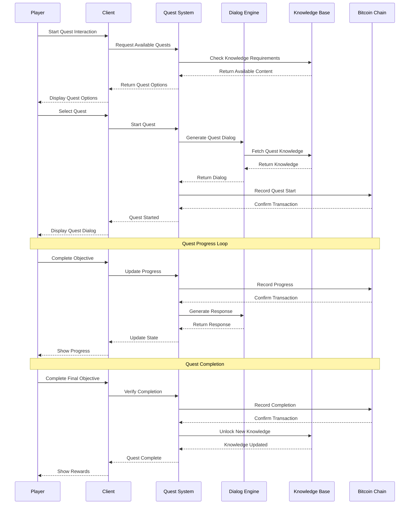
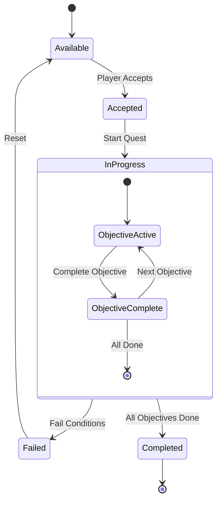
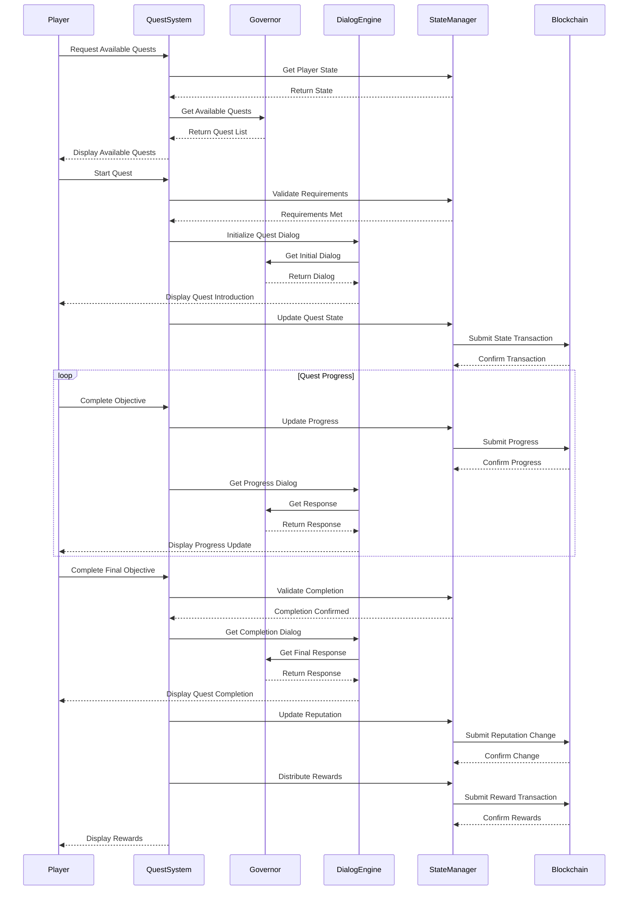

# Quest System Flow

## Quest Interaction Flow

## Quest State Flow

## Component Descriptions

### Participants
- **Player**: End user interacting with the system
- **Client**: Local game client handling UI and state
- **Quest System**: Core quest management system
- **Dialog Engine**: Handles NPC interactions and responses
- **Knowledge Base**: Stores and manages game knowledge
- **Bitcoin Chain**: Permanent record of game state

### Key Interactions
1. **Quest Discovery**
   - Player initiates quest interaction
   - System checks requirements
   - Available quests are presented

2. **Quest Initiation**
   - Player selects quest
   - System validates and starts quest
   - Initial dialog is generated
   - State is recorded on-chain

3. **Quest Progress**
   - Player completes objectives
   - Progress is validated and recorded
   - Appropriate responses are generated
   - State is updated on-chain

4. **Quest Completion**
   - Final objective completion
   - System verifies all requirements
   - Records completion on-chain
   - Unlocks new knowledge/content
   - Distributes rewards

### State Transitions
- **Available**: Quest can be started
- **Accepted**: Player has accepted but not started
- **InProgress**: Active quest with objectives
- **Failed**: Failed to meet requirements
- **Completed**: Successfully finished

### On-Chain Integration
- Quest starts are recorded
- Progress is tracked
- Completions are permanent
- Rewards are distributed
- Knowledge unlocks are tracked 

# Quest Flow Sequence Diagram

## Overview
This diagram illustrates the sequence of interactions between system components during quest initiation, progression, and completion.

## Diagram

## Component Descriptions

### Player
- Initiates quest interactions
- Completes objectives
- Receives feedback and rewards

### QuestSystem
- Manages quest availability and progression
- Coordinates between components
- Handles objective completion
- Distributes rewards

### Governor
- Provides quest content
- Generates contextual responses
- Validates quest-specific actions

### DialogEngine
- Manages conversation flow
- Generates appropriate responses
- Handles quest-related dialog

### StateManager
- Maintains game state
- Validates state changes
- Manages state persistence

### Blockchain
- Stores permanent state
- Validates transactions
- Ensures data integrity

## Key Interactions

1. **Quest Discovery**
   - Player requests available quests
   - System checks eligibility
   - Governor provides quest options

2. **Quest Initiation**
   - Player starts quest
   - System validates requirements
   - Dialog engine begins quest narrative

3. **Progress Tracking**
   - Player completes objectives
   - System updates state
   - Blockchain confirms changes

4. **Quest Completion**
   - System validates completion
   - Updates reputation
   - Distributes rewards

## Error Handling

The sequence includes implicit error handling:
- Requirement validation
- State verification
- Transaction confirmation
- Progress validation

## State Management

All state changes are:
1. Validated locally
2. Submitted to blockchain
3. Confirmed before proceeding
4. Synchronized across components 