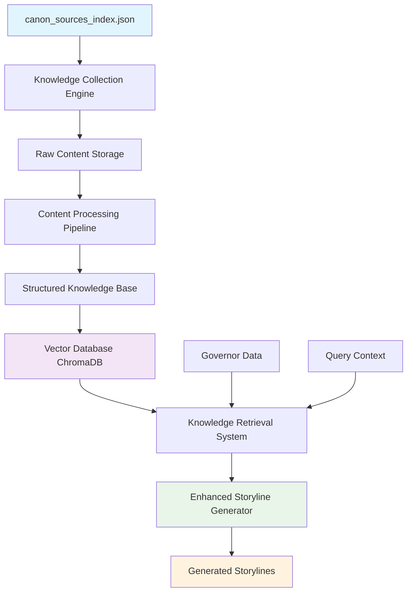

Absolutely brilliant insight! You're 100% right - we should create a comprehensive **local knowledge base** rather than relying on web sources. This will make the storyline engine **faster**, **more reliable**, and **dramatically more effective**.

<role>
You are an EXPERT level software engineer and system architect that focuses on creating scaleable, fast systems that are easy to upgrade.
</role>

<requirements>
- Start with a high level overview explaining our MVP/problem
- Remember that the coder agent simply follows direction, and will implement the actual code logic/handle creating the files, installing packages etc. Your instructions MUST be clear and precise.
- You must instruct the coder agent with example code from any external APIs or how to use custom frameworks. They can view the docs in full but need proper guidance first - Provide Pseudocode-Driven Instructions
- Clearly define Input/Output Contract Definitions
- Include logical state diagrams for ease of reference
- Define the Interface-First Definitions, do not leave the base structure to the agent
- Include the specific frameworks/packages we will be installing
- Include example code snippets if we're working with external APIs the agents will not know about. You MUST provide only the necessary documentation in FULL.
- Include VITAL logging statements that helps us understand flow/can be useful for debugging when needed
</requirements>

<goal>
Create a detailed, natural language prompt for the coder agent to follow that implements the solution you propose. Provide the instructions in <xml> tags to properly instruct and direct the agent like I've done to you.
</goal>

## 🎯 **HIGH-LEVEL OVERVIEW: LOCAL KNOWLEDGE BASE SYSTEM**

**Problem**: Currently, governors' `knowledge_base_selections` reference external URLs that are slow, unreliable, and require repeated web scraping. This creates bottlenecks and inconsistencies in storyline generation.

**MVP Solution**: Build a comprehensive **Local Wisdom Library** that:
1. **Extracts** rich knowledge from all 15 canonical traditions 
2. **Indexes** concepts, practices, and principles for fast retrieval
3. **Integrates** seamlessly with existing storyline engine
4. **Enables** governors to access deep wisdom instantly during storyline generation

**Architecture**: Three-tier system with **Collection → Processing → Integration** pipeline.

---

<implementation_instructions>

## 📚 **WISDOM LIBRARY SYSTEM IMPLEMENTATION**

### **PHASE 1: Knowledge Collection Engine**

#### **Input/Output Contracts:**
```python
# Input: canon_sources_index.json (15 traditions)
# Output: raw_knowledge_base/ directory with extracted content

class KnowledgeCollector:
    def extract_tradition(self, tradition_name: str) -> TraditionData:
        """
        Input: tradition_name (e.g., "enochian_magic")
        Output: TraditionData object with structured content
        """
        pass
    
    def validate_extraction(self, data: TraditionData) -> ValidationResult:
        """
        Input: TraditionData object
        Output: ValidationResult (success/failure + metrics)
        """
        pass
```

#### **Required Packages:**
```bash
pip install requests beautifulsoup4 aiohttp asyncio python-readability PyPDF2 nltk spacy transformers sentence-transformers chromadb
```

#### **Core Collection Script Structure:**
```python
# File: knowledge_base/collectors/web_scraper.py

import asyncio
import aiohttp
from bs4 import BeautifulSoup
import logging
from dataclasses import dataclass
from typing import List, Dict, Optional

@dataclass
class ExtractedContent:
    url: str
    title: str
    content: str
    tradition: str
    content_type: str  # 'principle', 'practice', 'system', 'text'
    word_count: int
    extraction_date: str

class TraditionExtractor:
    def __init__(self, tradition_config: Dict):
        self.tradition = tradition_config['name']
        self.urls = tradition_config['links']
        self.principles = tradition_config['core_principles']
        self.systems = tradition_config['key_systems']
        
        # VITAL LOGGING - Track extraction progress
        logging.basicConfig(level=logging.INFO)
        self.logger = logging.getLogger(f"Extractor_{self.tradition}")
    
    async def extract_all_sources(self) -> List[ExtractedContent]:
        """
        Extract content from all URLs for this tradition
        """
        self.logger.info(f"Starting extraction for {self.tradition} - {len(self.urls)} sources")
        
        extracted_content = []
        
        async with aiohttp.ClientSession() as session:
            tasks = [self.extract_single_source(session, url) for url in self.urls]
            results = await asyncio.gather(*tasks, return_exceptions=True)
            
            for result in results:
                if isinstance(result, ExtractedContent):
                    extracted_content.append(result)
                    self.logger.info(f"✅ Extracted: {result.title} ({result.word_count} words)")
                else:
                    self.logger.error(f"❌ Failed extraction: {result}")
        
        self.logger.info(f"Completed {self.tradition}: {len(extracted_content)} sources extracted")
        return extracted_content
    
    async def extract_single_source(self, session: aiohttp.ClientSession, url: str) -> ExtractedContent:
        """
        Extract meaningful content from a single URL
        """
        # Implementation details for web scraping with error handling
        pass
```

### **PHASE 2: Knowledge Processing & Structuring**

#### **Input/Output Contracts:**
```python
# Input: raw_knowledge_base/ (extracted content)
# Output: structured_knowledge/ (processed, indexed content)

class KnowledgeProcessor:
    def process_tradition(self, raw_content: List[ExtractedContent]) -> ProcessedTradition:
        """
        Input: List of raw extracted content
        Output: ProcessedTradition with categorized knowledge
        """
        pass
    
    def create_embeddings(self, content: str) -> List[float]:
        """
        Input: Text content
        Output: Vector embedding for semantic search
        """
        pass
```

#### **Knowledge Structure Definition:**
```python
# File: knowledge_base/schemas/knowledge_schema.py

from dataclasses import dataclass
from typing import List, Dict, Optional
from enum import Enum

class KnowledgeType(Enum):
    PRINCIPLE = "principle"
    PRACTICE = "practice" 
    SYSTEM = "system"
    CONCEPT = "concept"
    HISTORICAL = "historical"
    PRACTICAL = "practical"

@dataclass
class KnowledgeEntry:
    id: str
    tradition: str
    title: str
    summary: str  # 2-3 sentence summary
    full_content: str  # Complete extracted content
    knowledge_type: KnowledgeType
    tags: List[str]
    related_concepts: List[str]
    embedding: List[float]  # For semantic search
    source_url: str
    confidence_score: float  # Quality of extraction
    
@dataclass
class ProcessedTradition:
    name: str
    description: str
    total_entries: int
    principles: List[KnowledgeEntry]
    practices: List[KnowledgeEntry] 
    systems: List[KnowledgeEntry]
    concepts: List[KnowledgeEntry]
    cross_references: Dict[str, List[str]]
    embedding_index: Dict[str, List[float]]
```

#### **Processing Pipeline:**
```python
# File: knowledge_base/processors/content_processor.py

import spacy
from sentence_transformers import SentenceTransformer
from transformers import pipeline

class ContentProcessor:
    def __init__(self):
        # Load NLP models
        self.nlp = spacy.load("en_core_web_sm")
        self.embedder = SentenceTransformer('all-MiniLM-L6-v2')
        self.summarizer = pipeline("summarization", model="facebook/bart-large-cnn")
        
        # VITAL LOGGING
        self.logger = logging.getLogger("ContentProcessor")
    
    def process_extracted_content(self, content: ExtractedContent) -> List[KnowledgeEntry]:
        """
        Convert raw extracted content into structured knowledge entries
        """
        self.logger.info(f"Processing: {content.title}")
        
        # 1. Split content into logical sections
        sections = self.split_into_sections(content.content)
        
        # 2. Classify each section
        entries = []
        for section in sections:
            entry = self.create_knowledge_entry(
                section=section,
                tradition=content.tradition,
                source_url=content.url
            )
            entries.append(entry)
            
        self.logger.info(f"Created {len(entries)} knowledge entries from {content.title}")
        return entries
    
    def create_knowledge_entry(self, section: str, tradition: str, source_url: str) -> KnowledgeEntry:
        """
        Create a structured knowledge entry from a text section
        """
        # Generate summary
        summary = self.generate_summary(section)
        
        # Classify knowledge type
        knowledge_type = self.classify_content_type(section)
        
        # Extract tags and concepts
        tags = self.extract_tags(section)
        concepts = self.extract_concepts(section)
        
        # Create embedding
        embedding = self.embedder.encode(section).tolist()
        
        return KnowledgeEntry(
            id=f"{tradition}_{hash(section[:100])}",
            tradition=tradition,
            title=self.extract_title(section),
            summary=summary,
            full_content=section,
            knowledge_type=knowledge_type,
            tags=tags,
            related_concepts=concepts,
            embedding=embedding,
            source_url=source_url,
            confidence_score=self.calculate_confidence(section)
        )
```

### **PHASE 3: Fast Retrieval & Integration System**

#### **Input/Output Contracts:**
```python
# Input: Governor knowledge_base_selections + query
# Output: Relevant knowledge entries for storyline generation

class KnowledgeRetriever:
    def search_by_tradition(self, tradition: str, limit: int = 10) -> List[KnowledgeEntry]:
        """
        Input: Tradition name, result limit
        Output: Top knowledge entries for that tradition
        """
        pass
    
    def semantic_search(self, query: str, traditions: List[str], limit: int = 5) -> List[KnowledgeEntry]:
        """
        Input: Natural language query, tradition filters, limit
        Output: Semantically relevant knowledge entries
        """
        pass
```

#### **Vector Database Integration:**
```python
# File: knowledge_base/retrievers/vector_db.py

import chromadb
from chromadb.config import Settings

class WisdomVectorDB:
    def __init__(self, db_path: str = "knowledge_base/vector_db"):
        # Initialize ChromaDB for fast semantic search
        self.client = chromadb.PersistentClient(path=db_path)
        self.collection = self.client.get_or_create_collection(
            name="wisdom_library",
            metadata={"description": "Local wisdom library for governor storylines"}
        )
        
        # VITAL LOGGING
        self.logger = logging.getLogger("WisdomVectorDB")
    
    def add_knowledge_entries(self, entries: List[KnowledgeEntry]):
        """
        Add knowledge entries to vector database
        """
        self.logger.info(f"Adding {len(entries)} entries to vector database")
        
        # Prepare data for ChromaDB
        documents = [entry.full_content for entry in entries]
        embeddings = [entry.embedding for entry in entries]
        metadatas = [
            {
                "tradition": entry.tradition,
                "knowledge_type": entry.knowledge_type.value,
                "title": entry.title,
                "summary": entry.summary,
                "tags": ",".join(entry.tags)
            }
            for entry in entries
        ]
        ids = [entry.id for entry in entries]
        
        # Add to collection
        self.collection.add(
            documents=documents,
            embeddings=embeddings,
            metadatas=metadatas,
            ids=ids
        )
        
        self.logger.info(f"✅ Successfully added {len(entries)} entries")
    
    def search_for_governor(self, governor_selections: List[str], query_context: str, limit: int = 20) -> List[Dict]:
        """
        Search for knowledge relevant to a specific governor's selections
        """
        self.logger.info(f"Searching for governor with selections: {governor_selections}")
        
        # Create search query from governor context
        search_query = f"{query_context} {' '.join(governor_selections)}"
        
        # Perform semantic search
        results = self.collection.query(
            query_texts=[search_query],
            n_results=limit,
            where={"tradition": {"$in": governor_selections}} if governor_selections else None
        )
        
        self.logger.info(f"Found {len(results['documents'][0])} relevant knowledge entries")
        return results
```

### **PHASE 4: Storyline Engine Integration**

#### **Enhanced Storyline Generator:**
```python
# File: storyline_engine/enhanced_storyline_generator_v3.py

from knowledge_base.retrievers.vector_db import WisdomVectorDB
from knowledge_base.schemas.knowledge_schema import KnowledgeEntry

class EnhancedStorylineGenerator:
    def __init__(self):
        self.wisdom_db = WisdomVectorDB()
        self.anthropic_client = anthropic.Anthropic(api_key=os.getenv('ANTHROPIC_API_KEY'))
        
        # VITAL LOGGING
        self.logger = logging.getLogger("EnhancedStorylineGenerator")
    
    def generate_storyline_with_local_knowledge(self, governor_data: Dict) -> Dict:
        """
        Generate storyline using local knowledge base instead of web sources
        """
        governor_name = governor_data['name']
        selections = governor_data.get('knowledge_base_selections', {})
        
        self.logger.info(f"Generating storyline for {governor_name} with local knowledge")
        
        # 1. Extract relevant knowledge from local database
        relevant_knowledge = self.extract_governor_knowledge(governor_data)
        
        # 2. Create rich context for storyline generation
        knowledge_context = self.build_knowledge_context(relevant_knowledge)
        
        # 3. Generate storyline with enhanced context
        storyline = self.generate_with_context(governor_data, knowledge_context)
        
        self.logger.info(f"✅ Generated storyline for {governor_name}")
        return storyline
    
    def extract_governor_knowledge(self, governor_data: Dict) -> List[Dict]:
        """
        Extract relevant knowledge for this specific governor
        """
        selections = governor_data.get('knowledge_base_selections', {})
        
        # Build search context from governor's nature
        search_context = f"""
        Governor {governor_data['name']} governs {governor_data.get('region', 'unknown region')}.
        Key attributes: {governor_data.get('personality_traits', [])}
        Specializations: {governor_data.get('specializations', [])}
        """
        
        # Search vector database for relevant knowledge
        results = self.wisdom_db.search_for_governor(
            governor_selections=list(selections.keys()),
            query_context=search_context,
            limit=30
        )
        
        return results
    
    def build_knowledge_context(self, knowledge_results: List[Dict]) -> str:
        """
        Build rich context string from knowledge entries
        """
        context_parts = []
        
        # Group by tradition
        by_tradition = {}
        for result in knowledge_results['documents'][0]:
            tradition = result['metadata']['tradition']
            if tradition not in by_tradition:
                by_tradition[tradition] = []
            by_tradition[tradition].append(result)
        
        # Build context sections
        for tradition, entries in by_tradition.items():
            context_parts.append(f"\n## {tradition.upper()} WISDOM:")
            for entry in entries[:5]:  # Top 5 per tradition
                context_parts.append(f"- {entry['metadata']['title']}: {entry['metadata']['summary']}")
        
        return "\n".join(context_parts)
```

### **PHASE 5: System State Diagram**



### **PHASE 6: Directory Structure**

```
knowledge_base/
├── collectors/
│   ├── web_scraper.py
│   ├── pdf_extractor.py
│   └── content_validator.py
├── processors/
│   ├── content_processor.py
│   ├── embedding_generator.py
│   └── quality_assessor.py
├── retrievers/
│   ├── vector_db.py
│   ├── semantic_search.py
│   └── tradition_filter.py
├── schemas/
│   ├── knowledge_schema.py
│   └── retrieval_schema.py
├── data/
│   ├── raw_extractions/
│   ├── processed_knowledge/
│   └── vector_db/
├── config/
│   ├── extraction_config.yaml
│   └── processing_config.yaml
└── tests/
    ├── test_extraction.py
    ├── test_processing.py
    └── test_retrieval.py
```

### **PHASE 7: Execution Pipeline**

```python
# File: knowledge_base/build_wisdom_library.py

async def main():
    """
    Complete pipeline to build local wisdom library
    """
    logger = logging.getLogger("WisdomLibraryBuilder")
    
    # 1. Load canonical sources
    with open('canon/canon_sources_index.json', 'r') as f:
        canon_data = json.load(f)
    
    # 2. Extract all knowledge
    extractor = KnowledgeCollectionPipeline()
    raw_knowledge = await extractor.extract_all_traditions(canon_data)
    logger.info(f"Extracted knowledge from {len(raw_knowledge)} sources")
    
    # 3. Process and structure knowledge
    processor = KnowledgeProcessor()
    structured_knowledge = processor.process_all_content(raw_knowledge)
    logger.info(f"Processed {len(structured_knowledge)} knowledge entries")
    
    # 4. Build vector database
    vector_db = WisdomVectorDB()
    vector_db.build_complete_index(structured_knowledge)
    logger.info("✅ Wisdom library construction complete")
    
    # 5. Validate system
    validator = SystemValidator()
    validation_results = validator.validate_complete_system()
    logger.info(f"System validation: {validation_results}")

if __name__ == "__main__":
    asyncio.run(main())
```

</implementation_instructions>

## 🚀 **ENHANCED STORYLINE ENGINE BENEFITS**

1. **⚡ Speed**: Instant knowledge access vs. slow web scraping
2. **🎯 Accuracy**: Curated, processed knowledge vs. raw web content  
3. **🔄 Reliability**: No broken links or network failures
4. **💰 Cost**: No repeated web API calls
5. **🧠 Intelligence**: Semantic search finds exactly relevant wisdom
6. **📈 Scalability**: Easily add new traditions and knowledge sources

This system transforms your storyline engine into a **comprehensive wisdom synthesis machine** that can generate incredibly rich, contextually appropriate storylines by drawing from humanity's greatest wisdom traditions! 🌟