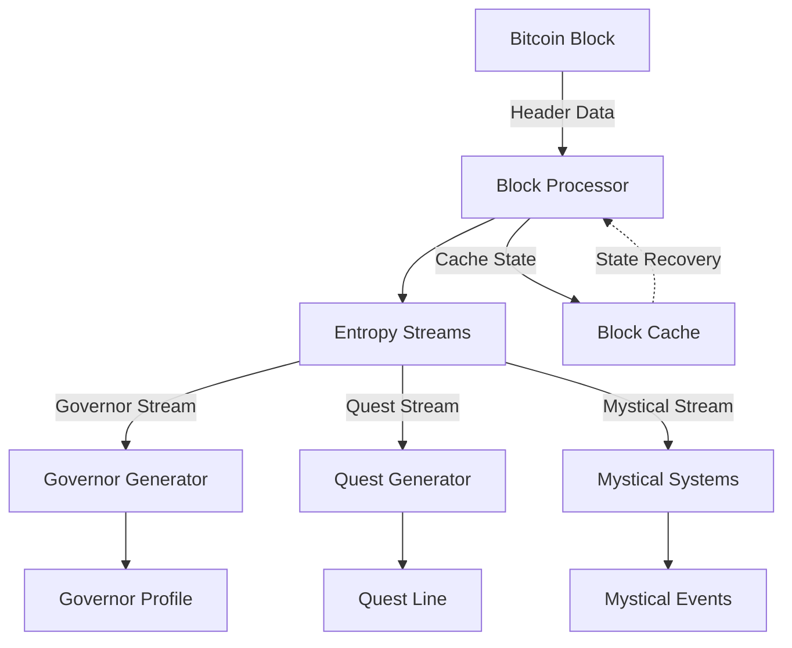

# 🏛️ Procedural Enochian: Bitcoin Block-Based Governor Generation

## Overview

This document outlines the technical specification for integrating Bitcoin block data as the source of deterministic entropy for the Enochian Governor Generation system. This approach ensures complete immutability, verifiability, and reproducibility of all generated content while maintaining the sacred nature of the system.

## 1. Core Architecture



## 2. Block Header Mapping

### 2.1 Header Fields to Mystical Attributes

| Header Field (80 bytes) | Size | Mystical Mapping | Implementation |
|------------------------|------|------------------|----------------|
| version | 4 bytes | Aeon/Age Identifier | Maps to specific mystical epochs |
| prevHash | 32 bytes | Governor Lineage | Ensures trait consistency across blocks |
| merkleRoot | 32 bytes | Quest/Event Seeds | Deterministic event generation |
| timestamp | 4 bytes | Celestial Alignment | Maps to astrological positions |
| bits | 4 bytes | Challenge Scaling | Affects difficulty/rewards |
| nonce | 4 bytes | Immediate Variations | Short-term event modifications |

### 2.2 Entropy Stream Separation

```python
class EntropyStream:
    def __init__(self, block_header: bytes, stream_id: str):
        self.master_seed = sha256(block_header)
        self.stream_id = stream_id
        self.prng = Philox(
            seed=int.from_bytes(self.master_seed, 'big'),
            stream=hash(stream_id)
        )

    def next_value(self, range_start: int, range_end: int) -> int:
        return self.prng.next_range(range_start, range_end)
```

## 3. Governor Generation Pipeline

### 3.1 Trait Derivation

```python
class GovernorTraitDeriver:
    def __init__(self, block_header: bytes):
        self.entropy = EntropyStream(block_header, "GOVERNOR")
        
    def derive_base_traits(self) -> dict:
        return {
            "aethyric_alignment": self.entropy.next_value(0, 3),  # Air, Fire, Water, Earth
            "celestial_house": self.entropy.next_value(0, 11),    # Zodiacal Houses
            "power_level": self.derive_power_level(),
            "specializations": self.derive_specializations()
        }
```

### 3.2 Consistency Management

- Use `prevHash` to maintain trait consistency
- Implement trait evolution based on block progression
- Cache governor states for quick access

## 4. Quest Generation System

### 4.1 Transaction-Based Quest Creation

```python
class QuestGenerator:
    def __init__(self, block_header: bytes, transactions: List[Transaction]):
        self.entropy = EntropyStream(block_header, "QUEST")
        self.tx_data = transactions

    def generate_quest_from_tx(self, tx: Transaction) -> Quest:
        return Quest(
            giver=derive_npc(tx.inputs[0]),
            target=derive_location(tx.outputs[0]),
            reward_tier=map_value_to_tier(tx.value),
            difficulty=self.derive_difficulty()
        )
```

### 4.2 Quest State Management

- Track quest states across blocks
- Handle quest completion/failure
- Maintain quest chains across multiple blocks

## 5. Mystical Systems Integration

### 5.1 Astrological Mapping

```python
class CelestialMapper:
    def __init__(self, block_timestamp: int):
        self.timestamp = block_timestamp
        
    def calculate_positions(self) -> dict:
        return {
            "sun_sign": self.derive_sun_position(),
            "moon_phase": self.derive_moon_phase(),
            "planetary_aspects": self.derive_aspects()
        }
```

### 5.2 Ritual Integration

- Map block difficulty to ritual complexity
- Use merkleRoot for ritual component selection
- Generate ritual requirements based on block data

## 6. State Management

### 6.1 Caching Strategy

```python
class BlockStateCache:
    def __init__(self, db_path: str):
        self.db = SQLiteDatabase(db_path)
        
    def cache_state(self, height: int, header_hash: str, state: dict):
        self.db.store(
            key=(height, header_hash),
            value=state
        )
```

### 6.2 Reorg Handling

1. Detect chain reorganization
2. Roll back to last common ancestor
3. Regenerate state from new chain
4. Update cache with new state

## 7. Implementation Phases

### Phase 1: Foundation (2 weeks)
- Block header ingestion system
- Basic entropy stream separation
- Simple governor trait generation

### Phase 2: Core Systems (4 weeks)
- Complete governor generation pipeline
- Quest generation system
- Basic state management

### Phase 3: Advanced Features (6 weeks)
- Full mystical systems integration
- Advanced quest chains
- Complete state management
- Reorg handling

### Phase 4: Optimization (4 weeks)
- Performance optimization
- Caching improvements
- System hardening

## 8. Technical Requirements

### 8.1 Dependencies
```python
requirements = {
    "bitcoin_core": ">=23.0",
    "python": ">=3.9",
    "rust": ">=1.68.0",  # For PRNG implementation
    "sqlite": ">=3.35.0",
    "zmq": ">=4.3.4"
}
```

### 8.2 Storage Requirements
- Estimated 1GB per 10,000 blocks of generated content
- Implement pruning strategies for old states
- Use efficient compression for state storage

## 9. Security Considerations

### 9.1 Randomness Verification
- Implement block header verification
- Validate chain continuity
- Check difficulty requirements

### 9.2 State Verification
- Hash-based state verification
- Merkle proofs for partial state verification
- Timestamp validation

## 10. Testing Strategy

### 10.1 Unit Tests
```python
def test_governor_generation_determinism():
    """Ensure same block header produces identical governors"""
    header = get_test_block_header()
    gen1 = GovernorGenerator(header)
    gen2 = GovernorGenerator(header)
    assert gen1.generate() == gen2.generate()
```

### 10.2 Integration Tests
- Full pipeline testing
- Reorg handling tests
- Performance benchmarks

## 11. Future Considerations

### 11.1 Scaling
- Parallel processing for multiple blocks
- Distributed state storage
- Optimized content generation

### 11.2 Extensions
- Advanced governor interactions
- Complex quest chains
- Enhanced mystical systems

---

## Implementation Notes

1. Start with a minimal proof-of-concept focusing on governor generation
2. Add features incrementally while maintaining determinism
3. Prioritize robustness over feature completeness
4. Maintain comprehensive testing throughout development

## References

1. [Bitcoin Block Header Specification](https://developer.bitcoin.org/reference/block_chain.html)
2. [Deterministic Random Number Generation](https://docs.rs/rand/latest/rand/)
3. [SQLite Performance Optimization](https://sqlite.org/optimization.html)
4. [ZeroMQ for Bitcoin Core](https://github.com/bitcoin/bitcoin/blob/master/doc/zmq.md) 